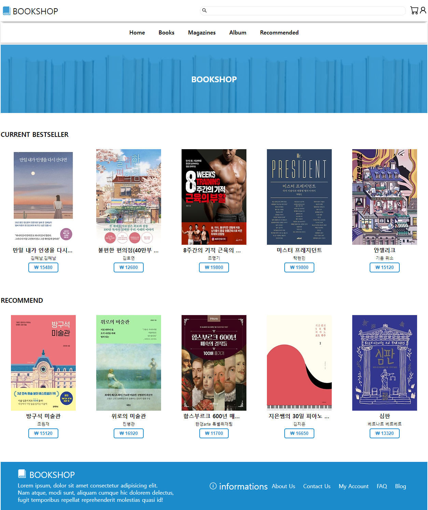
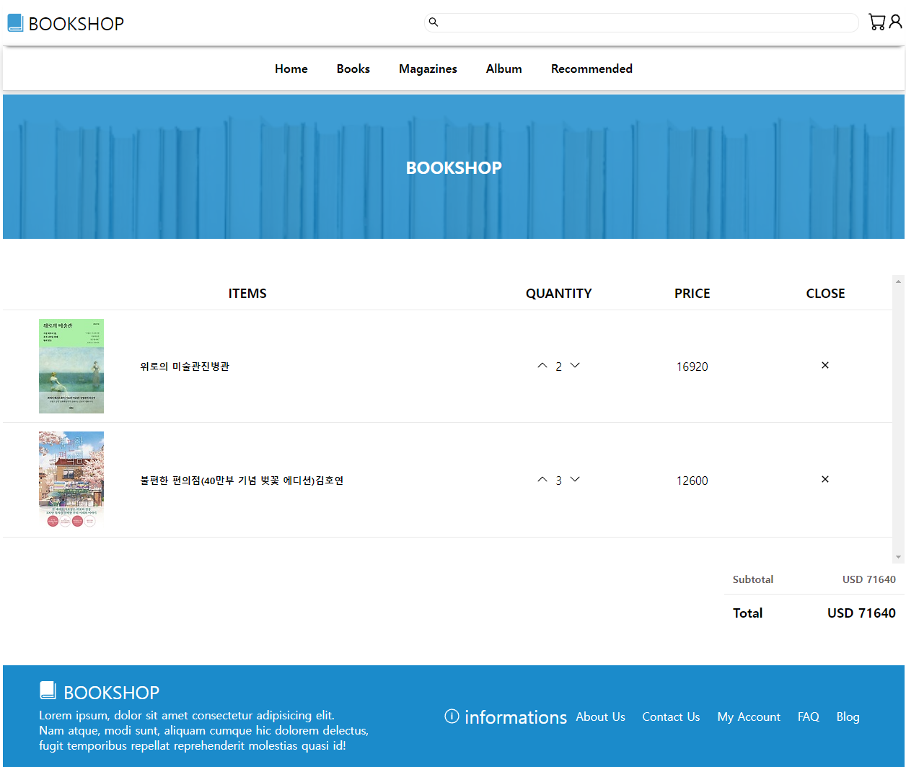

# React 연습
## 연습목표
* react-router context reducer 사용하기
* 컴포넌트 재활용하기
* 데이터를 서버에서 받아서 활용하기

## 기능 구현 목록
* 장바구니 기능 - 장바구니에 아이템 추가, 장바구니 아이템 수량에 따라 가격 합산
* 검색 기능 - 검색 키워드 공백일 시 검색 불가, 일치하는 결과 없을 시 페이지에 결과 없음 문구 표기, 검색 결과가 중복 일시 문제 해결하기

## 캡쳐본

* 전체 화면

* 카트 화면

